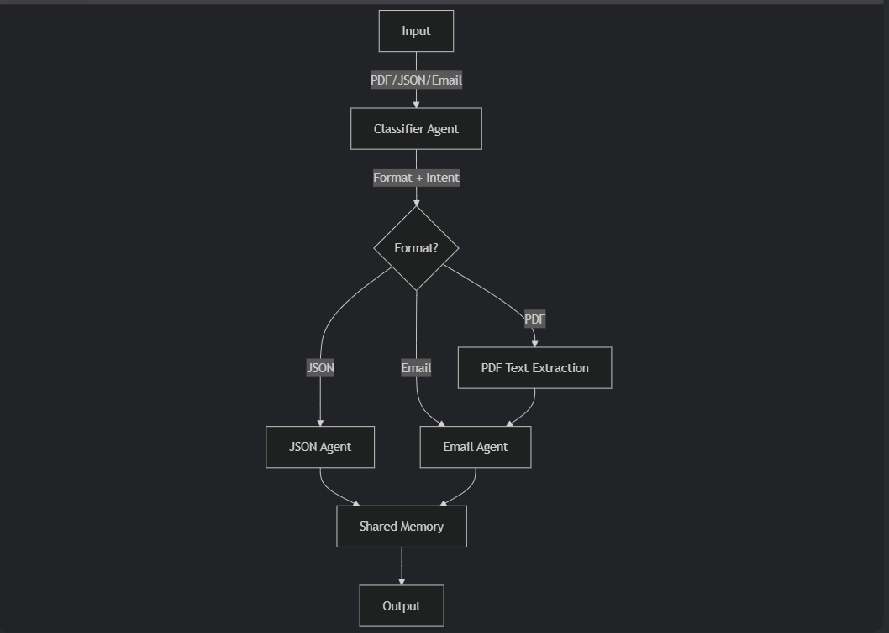

🧠 Multi-Agent Document Processing System
A lightweight multi-agent AI system that classifies and processes PDF, JSON, and email documents while maintaining shared context for traceability.

🚀 Key Features
Format Classification
Automatically detects PDF, JSON, and email formats.

Intent Recognition
Identifies document purpose (e.g., Invoice, RFQ, Complaint).

Agent-Based Processing

JSON Agent: Validates and reformats structured data.

Email Agent: Extracts key information from emails.

PDF Agent: Processes text content from PDFs.

Context Tracking
Maintains conversation history and processing traceability.

Lightweight Architecture
SQLite-based memory module for easy deployment.

🧱 System Architecture

🛠 Tech Stack
Language: Python 3.9+

LLM Integration: Ollama (local LLMs)

Memory Storage: SQLite

PDF Processing: PyPDF2

Supported Models: Mistral, LLaMA 3, Phi-3 (via Ollama)

📦 Installation
Clone the repository:

bash
Copy
Edit
git clone https://github.com/yourusername/document-processing-system.git
cd document-processing-system
Install dependencies:

bash
Copy
Edit
pip install -r requirements.txt
Set up Ollama:

Download and install Ollama.

Pull the required model:
ollama pull mistral

💡 Usage
▶️ Run Interactive Mode

python test_run.py

Example session:

🤖 Multi-Agent Document Processing System
----------------------------------------
Supported input types: PDF, JSON, Email
Type 'exit' to quit

Enter document path, JSON string, or email text: sample_invoice.pdf
⏳ Extracting text from PDF...
✅ PDF text extracted (2845 characters)
🔍 Classifying document...
📋 Classification: pdf | Invoice
📧 Processing email content...
⏱️ Processing completed in 8.32 seconds

📦 Processing Result:
{
  "sender": "document",
  "subject": "Invoice #INV-2023-001",
  "intent": "Invoice",
  "important_dates": ["2023-12-15"],
  "requested_action": "Payment processing"
}
📝 Process Single Document in Code

from orchestrator import orchestrator

result = orchestrator(
    input_data="path/to/document.pdf",
    input_type="pdf"
)
print(result)
📂 Supported Input Types
Type	Input Format
PDF	File path or URL
JSON	Dictionary or JSON string
Email	Raw email text

Examples:

# PDF
orchestrator("/path/to/file.pdf")

# JSON
orchestrator({"invoice_id": "INV-123", "amount": 1500.50})

# Email
orchestrator("From: sender@example.com\nSubject: Urgent Request\n...")
✅ Sample Test Cases
Input Type	Sample Input	Expected Intent
JSON	{"invoice_id": "INV-123", "amount": 1500.50}	Invoice
Email	Subject: Urgent RFQ\nNeed quotes for 100 laptops...	RFQ
PDF	Sample Invoice PDF	Invoice

👉 See TEST_CASES.md for more examples.

⚙️ Performance Optimization
PDF processing limited to first 5 pages

LLM inputs truncated to 2000 characters

Caching mechanism for frequent document types

Async processing for batch operations (experimental)

🧩 System Components
Component	Purpose	Key Functions
Classifier Agent	Document classification	classify_format_and_intent()
Email Agent	Email processing	email_agent()
JSON Agent	JSON validation	json_agent()
PDF Utilities	Text extraction	extract_text_from_pdf()
Shared Memory	Context tracking	log_entry(), get_history()
Orchestrator	Workflow management	orchestrator()
